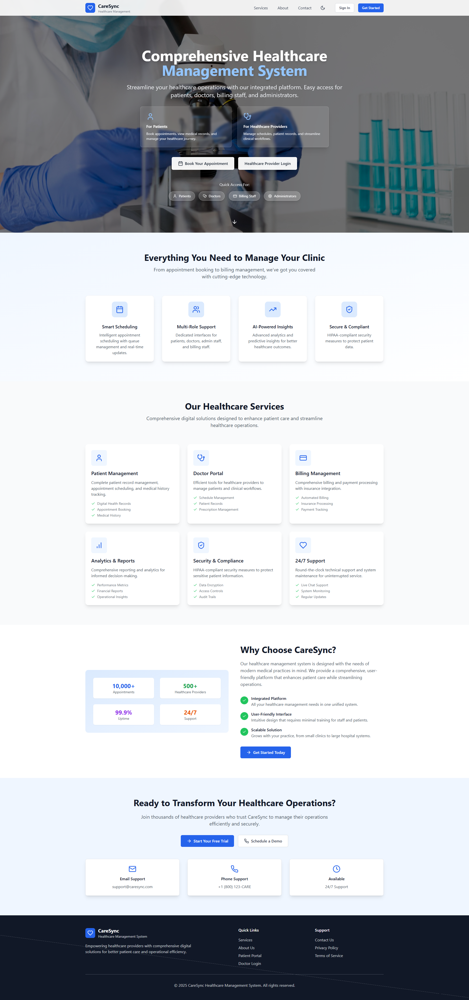
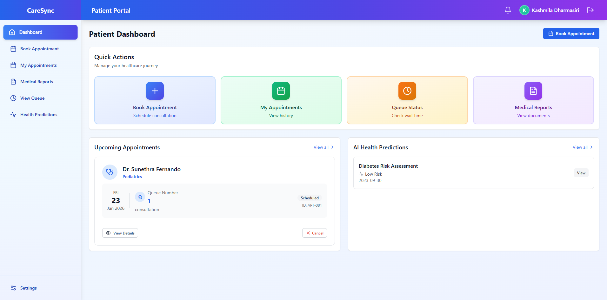
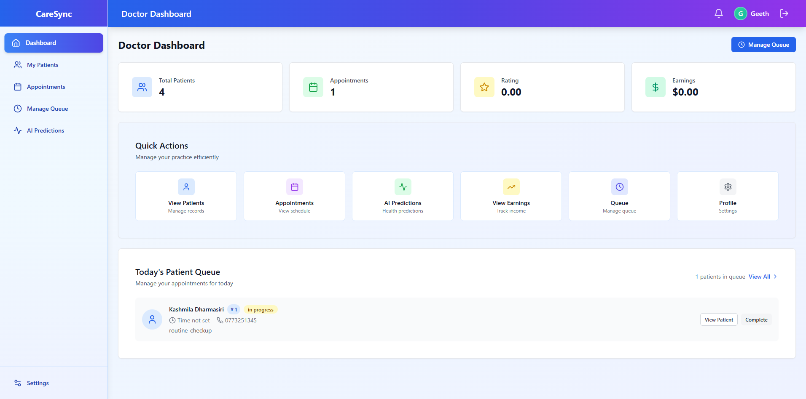
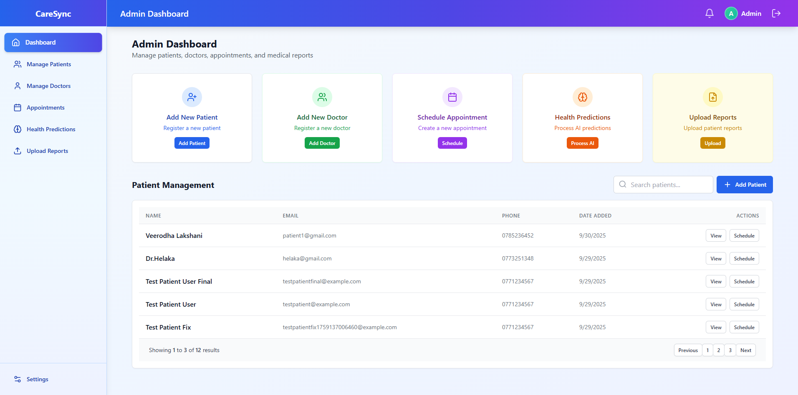
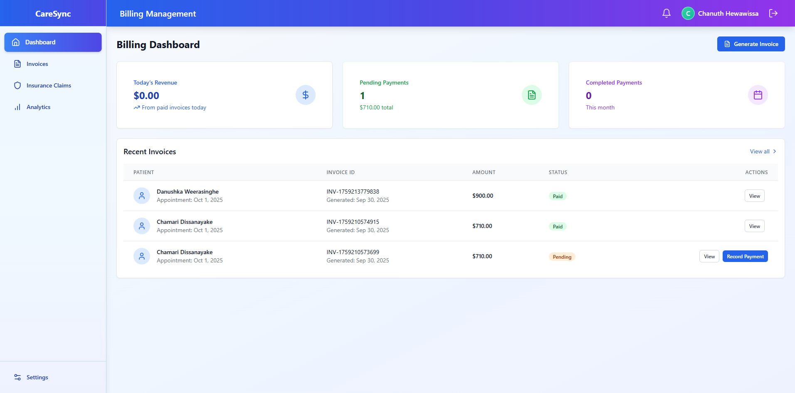

# 🏥 CareSync - Clinical Appointment Scheduling System

> A modern, full-featured healthcare management platform built with React, TypeScript, and Tailwind CSS

[](https://www.typescriptlang.org/)
[](https://reactjs.org/)
[](https://vitejs.dev/)
[](LICENSE)

## 📋 Table of Contents

- [Overview](#overview)
- [Features](#features)
- [Tech Stack](#tech-stack)
- [Project Structure](#project-structure)
- [Getting Started](#getting-started)
- [Environment Variables](#environment-variables)
- [Usage](#usage)
- [Screenshots](#screenshots)
- [Architecture](#architecture)
- [Contributing](#contributing)
- [License](#license)

## 🎯 Overview

CareSync is a comprehensive clinical appointment scheduling and healthcare management system designed for modern medical facilities. It provides role-based interfaces for patients, doctors, administrators, and billing staff, streamlining the entire healthcare workflow from appointment booking to billing and analytics.

### Key Highlights

✨ **Modern Tech Stack** - Built with React 18, TypeScript, and Vite for blazing-fast performance  
🎨 **Beautiful UI** - Responsive design with Tailwind CSS and smooth animations via Framer Motion  
🔐 **Secure Authentication** - Role-based access control with JWT tokens  
📊 **Real-time Updates** - Live queue management and appointment tracking  
🤖 **AI-Powered** - Health risk predictions using machine learning  
📱 **Mobile Responsive** - Fully optimized for all device sizes  

## ✨ Features

### 👨‍⚕️ For Patients

- **Smart Appointment Booking** - Search and filter doctors by specialty, experience, and ratings
- **Real-time Queue Management** - View queue position and estimated wait times
- **Medical Records Access** - Download and view medical reports securely
- **Health Predictions** - AI-powered diabetes and health risk assessments
- **Appointment History** - Track past and upcoming appointments with detailed information
- **Profile Management** - Update personal and medical information

### 🩺 For Doctors

- **Comprehensive Dashboard** - Overview of daily schedule and patient statistics
- **Patient Management** - Access detailed patient history, medical records, and health predictions
- **Queue Control** - Efficiently manage patient queues with real-time updates
- **AI Insights** - Access AI-generated health predictions for better diagnosis
- **Appointment Scheduling** - Create and manage appointments with patients
- **My Patients** - Quick access to regular patients and their medical history

### 🏢 For Administrators

- **System Analytics** - Real-time insights into system usage and performance
- **User Management** - Manage patients, doctors, and staff accounts
- **Doctor Certification** - Verify and manage doctor credentials and specializations
- **Appointment Oversight** - Monitor and manage all system appointments
- **Report Management** - Upload and organize medical reports
- **Health Analytics** - View system-wide health prediction statistics

### 💰 For Billing Staff

- **Financial Dashboard** - Overview of revenue, pending payments, and invoices
- **Invoice Management** - Generate, send, and track invoices
- **Insurance Claims** - Process and monitor insurance claims
- **Payment Tracking** - Monitor payment status and outstanding balances
- **Analytics & Reports** - Comprehensive financial reporting and insights

## 🛠️ Tech Stack

### Frontend
- **Framework**: React 18.3.1 with TypeScript 5.5.4
- **Build Tool**: Vite 6.3.5 (Fast HMR and optimized builds)
- **Styling**: Tailwind CSS 3.4.17 (Utility-first CSS)
- **Routing**: React Router DOM 6.26.2 (Client-side routing)
- **State Management**: Zustand (Lightweight and performant)
- **Animations**: Framer Motion 11.5.4 (Smooth animations)
- **Charts**: Chart.js 4.5.0 & Recharts 2.12.7 (Data visualization)
- **Icons**: Lucide React (Beautiful icon library)
- **Notifications**: Sonner 2.0.1 (Toast notifications)

### Code Quality
- **Linting**: ESLint with TypeScript support
- **Type Checking**: TypeScript strict mode
- **Auto Formatting**: Prettier (recommended)

### Backend Integration
- REST API communication
- JWT-based authentication
- Real-time data updates

## 📁 Project Structure

```
src/
├── assets/              # Images, icons, and static files
├── components/          # Reusable UI components
│   ├── common/          # Generic components (Button, Card, Input, etc.)
│   ├── layout/          # Layout components (Header, Sidebar, Layout)
│   ├── appointments/    # Appointment-related components
│   ├── charts/          # Chart components
│   └── profile/         # Profile components
├── pages/               # Page components (route views)
│   ├── landing/         # Landing page
│   ├── auth/            # Login and registration
│   ├── patient/         # Patient portal pages
│   ├── doctor/          # Doctor portal pages
│   ├── admin/           # Admin portal pages
│   └── billing/         # Billing portal pages
├── hooks/               # Custom React hooks
├── services/            # API services and external integrations
├── store/               # Zustand state management stores
├── contexts/            # React context providers
├── utils/               # Utility functions and helpers
├── types/               # TypeScript type definitions
├── styles/              # Global styles and CSS
└── __tests__/           # Test files (unit, integration, e2e)
```

## 🚀 Getting Started

### Prerequisites

- **Node.js** >= 18.0.0
- **npm** >= 9.0.0 or **yarn** >= 1.22.0
- **Git**

### Installation

1. **Clone the repository**
   ```bash
   git clone https://github.com/yourusername/caresync.git
   cd caresync/Clinical-Appointment-Scheduling-System
   ```

2. **Install dependencies**
   ```bash
   npm install
   # or
   yarn install
   ```

3. **Set up environment variables**
   ```bash
   cp .env.example .env
   ```
   
   Edit `.env` and configure:
   ```env
   VITE_API_URL=http://localhost:5000/api
   VITE_APP_NAME=CareSync
   ```

4. **Start the development server**
   ```bash
   npm run dev
   # or
   yarn dev
   ```

5. **Open your browser**
   Navigate to `http://localhost:5173`

### Building for Production

```bash
# Create optimized production build
npm run build

# Preview production build locally
npm run preview
```

The build output will be in the `dist/` directory.

## 🔧 Environment Variables

Create a `.env` file in the root directory:

```env
# API Configuration
VITE_API_URL=http://localhost:5000/api

# Application
VITE_APP_NAME=CareSync
VITE_APP_VERSION=1.0.0

# Optional: Feature Flags
VITE_ENABLE_AI_PREDICTIONS=true
VITE_ENABLE_DARK_MODE=true
```

## 📖 Usage

### Login Credentials (Demo)

**Patient**
- Email: `patient@example.com`
- Password: `password123`

**Doctor**
- Email: `doctor@example.com`
- Password: `password123`

**Admin**
- Email: `admin@example.com`
- Password: `password123`

**Billing**
- Email: `billing@example.com`
- Password: `password123`

### User Flows

#### Booking an Appointment (Patient)
1. Log in to the patient portal
2. Navigate to "Book Appointment"
3. Search for doctors by specialty or name
4. Select a doctor and available time slot
5. Confirm the appointment
6. Check queue status in real-time

#### Managing Patients (Doctor)
1. Log in to the doctor portal
2. View today's schedule on the dashboard
3. Access patient details and medical history
4. Manage the queue and call next patient
5. View AI-generated health predictions

#### System Administration (Admin)
1. Log in to the admin portal
2. View system analytics and statistics
3. Manage users (patients, doctors, staff)
4. Verify doctor certifications
5. Monitor appointments and generate reports

## 📸 Screenshots

### Landing Page

*Modern, responsive landing page with feature highlights*

### Patient Dashboard

*Comprehensive overview of appointments and health metrics*

### Doctor Dashboard

*Daily schedule and patient management interface*

### Admin Analytics

*System-wide analytics and reporting*

### Cashier Dashboard

*Financial overview and invoice management*


## 🏗️ Architecture

### State Management

The application uses **Zustand** for state management with three main stores:

- **authStore**: Authentication state, user profile, and session management
- **queueStore**: Queue management, position tracking, and real-time updates
- **healthDataStore**: Patient health data, predictions, and medical records

### API Integration

All API calls are centralized in the `services/` directory:
- Type-safe API requests with TypeScript
- Automatic token management
- Error handling and retry logic
- Request/response interceptors

### Routing Strategy

Protected routes with role-based access control:
- Public routes: Landing, Login, Register
- Patient routes: Dashboard, Appointments, Queue, Reports
- Doctor routes: Dashboard, Patients, Queue Management
- Admin routes: User Management, System Analytics
- Billing routes: Invoices, Claims, Reports

## 🧪 Testing

```bash
# Run all tests
npm test

# Run tests in watch mode
npm test -- --watch

# Run tests with coverage
npm test -- --coverage
```

### Test Structure
- **Unit Tests**: Components, hooks, and utility functions
- **Integration Tests**: User workflows and API interactions
- **E2E Tests**: Complete user journeys

## 🤝 Contributing

Contributions are welcome! Please follow these steps:

1. Fork the repository
2. Create a feature branch (`git checkout -b feature/AmazingFeature`)
3. Commit your changes (`git commit -m 'Add some AmazingFeature'`)
4. Push to the branch (`git push origin feature/AmazingFeature`)
5. Open a Pull Request

### Code Style

- Use TypeScript for all new code
- Follow the existing code structure and naming conventions
- Write unit tests for new features
- Ensure all tests pass before submitting PR
- Use meaningful commit messages

## 🐛 Known Issues & Roadmap

### Current Limitations
- Insurance claims functionality partially implemented (TODO in code)
- WebSocket support for real-time notifications (planned)

### Upcoming Features
- 📱 Mobile app (React Native)
- 🔔 Push notifications
- 📧 Email reminders
- 💬 In-app messaging
- 🌐 Multi-language support
- 📊 Advanced analytics dashboard

## 📝 License

This project is licensed under the MIT License - see the [LICENSE](LICENSE) file for details.

## 👥 Authors

- **Your Name** - *Initial work* - [GitHub](https://github.com/yourusername)

## 🙏 Acknowledgments

- Icons by [Lucide Icons](https://lucide.dev/)
- UI inspiration from modern healthcare platforms
- Chart components powered by Chart.js and Recharts

## 📞 Support

For support, email support@caresync.com or open an issue in the GitHub repository.

---

<div align="center">
  <p>Made with ❤️ by Your Name</p>
  <p>
    <a href="https://github.com/yourusername/caresync">⭐ Star this repo</a> |
    <a href="https://github.com/yourusername/caresync/issues">🐛 Report Bug</a> |
    <a href="https://github.com/yourusername/caresync/issues">✨ Request Feature</a>
  </p>
</div>
